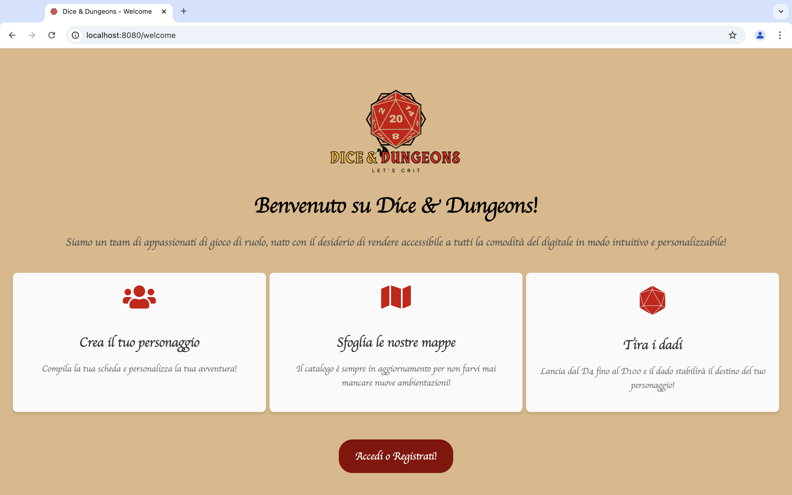
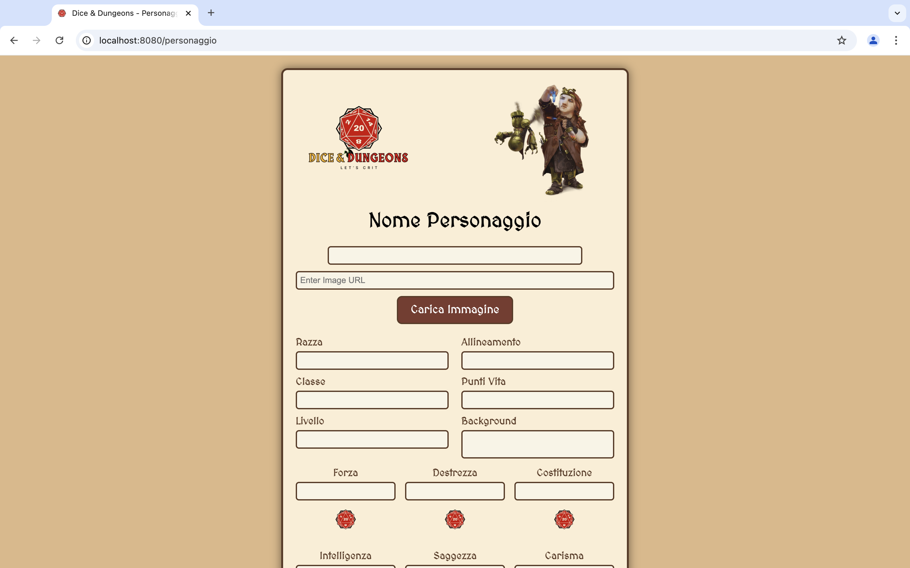
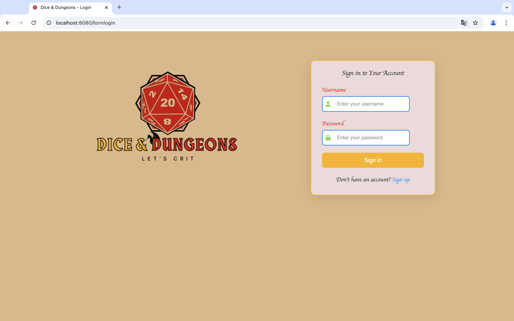
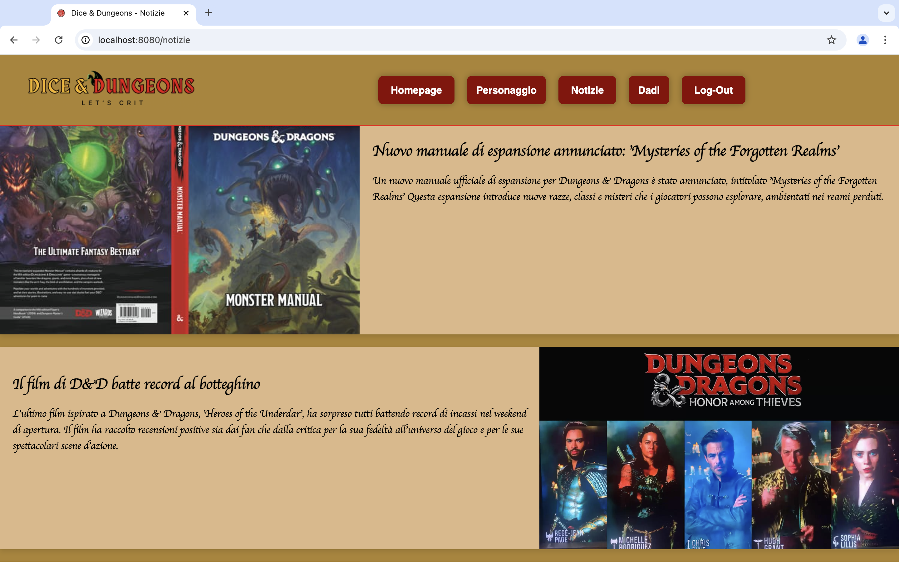

# 🎲 Dice & Dungeons – Gestionale da Tavolo Ispirato a D&D

## 📌 Contesto

Questo repository è un fork del project work finale del corso **Generation Italy – Java Full Stack Developer** che ho frequentato.  
Il progetto è stato sviluppato in team da 5 persone come esercitazione conclusiva per mettere in pratica tutte le competenze acquisite.

Questa versione è mantenuta a scopo personale e di portfolio.

---

## 🎯 Obiettivo del progetto

_Dice & Dungeons_ è un **mini gestionale per giochi da tavolo** ispirato all’universo di *Dungeons & Dragons*.  
Il sistema permette a gruppi di gioco di:

- 📍 Caricare e gestire **mappe personalizzate**
- 🧙‍♂️ Creare e visualizzare **schede personaggio** con attributi, immagini e dettagli
- 🎲 Simulare il lancio di **dadi digitali** (D6, D12, D20, ecc.)
- 📰 Gestire una **newsletter interna** per aggiornamenti del gruppo
- 🔐 Offrire **accesso protetto** tramite autenticazione

---

## 📂 Struttura generale del repository GIT

> **Nota:** Il codice sorgente principale si trova nel branch **developer**.  
> Il branch **main** contiene solo file di documentazione e configurazione.
> Per vedere il codice sorgente, seleziona il branch **developer** nel menu a tendina dei branch sopra alla lista dei file.

## 🛠️ Tecnologie utilizzate

### Backend
- ☕ **Java**
- 🌱 **Spring Boot**
- 🗃️ **Spring Data JPA** (comunicazione con database SQL)
- 🛡️ **Spring Security**

### Frontend
- 🧾 **HTML**, **CSS**, **JavaScript**
- 📄 **JSP** (JavaServer Pages)

---

## ✨ Contributi e modifiche personali

- Refactoring del codice
- Miglioramento della struttura del progetto
- Aggiornamento della documentazione
- Fork e mantenimento della versione per portfolio personale

---

## 📸 Screenshot

### 🏠 Homepage

### 🧙‍♂️ Scheda Personaggio  

### 🔐 Login  

### 📰 NewsLetter  

### 🎲 Lancio Dadi  

---

## 📣 Note finali

Il progetto rappresenta un **prototipo funzionante**, pensato per essere espandibile in futuro.  
Possibili evoluzioni includono:
- Integrazione di **mappe interattive**
- Aggiunta di **gestione campagne e inventario**
- Miglioramento della UI/UX e passaggio a **framework frontend moderni**

---

## 👤 Autore del fork

**John Nociforo**  
Sviluppatore Back-End Java  
📫 https://www.linkedin.com/in/john-nociforo/

---

## 🌐 English Summary

**Dice & Dungeons** is a mini desktop RPG management system inspired by *Dungeons & Dragons*, developed as a final team project during the **Generation Italy – Java Full Stack Developer** course.

### Features:
- Custom map uploads
- Character sheets with images and attributes
- Virtual dice (D6, D12, D20, etc.)
- Internal newsletter section
- Secure login system

### Tech Stack:
- Java, Spring Boot, Spring Data JPA, Spring Security
- HTML, CSS, JavaScript, JSP

This repository is a personal fork used to showcase my contributions and improvements.
